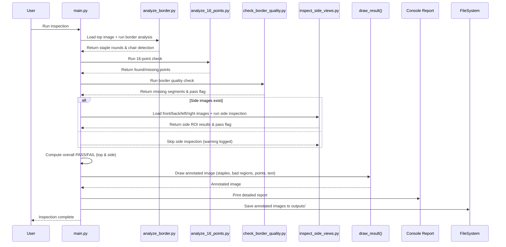

# Chair Staple Inspection System - Project Documentation

**Version:** 1.0.0  
**Date:** 2026-06-25  
**Author:** Parshva Panchal  

---

## Table of Contents
1. [Introduction](#1-introduction)  
2. [System Overview](#2-system-overview)  
3. [Architecture](#3-architecture)  
4. [Inspection Workflow](#4-inspection-workflow)  
5. [Data Flow Diagram](#5-data-flow-diagram)  
6. [Installation & Setup](#6-installation--setup)  
7. [Usage](#7-usage)  
8. [Configuration Files](#8-configuration-files)  
9. [Calibration Procedure](#9-calibration-procedure)  
10. [Testing & Validation](#10-testing--validation)  
11. [Troubleshooting](#11-troubleshooting)  
12. [Future Enhancements](#12-future-enhancements)  
13. [References](#13-references)  

---

## 1. Introduction
The Chair Staple Inspection System is a computer‑vision‑based quality‑control solution designed for chair manufacturing lines. It automatically verifies that staples are correctly placed in all critical locations (top, front, back, left, and right views) by analyzing images captured from fixed cameras. The system outputs a PASS/FAIL decision, generates annotated images for visual verification, and logs detailed inspection results for traceability.

## 2. System Overview
| Aspect | Description |
|--------|-------------|
| **Goal** | Replace manual visual staple inspection with an automated, repeatable, and objective process. |
| **Inputs** | JPEG/PNG images of chairs from five viewpoints: `top.jpg`, `front.jpg`, `back.jpg`, `left.jpg`, `right.jpg`. |
| **Outputs** | - Console report (PASS/FAIL per sub‑check and overall).<br>- Annotated result images saved in `outputs/` (e.g., `staple_rounds_result.jpg`, `*_result.jpg`).<br>- Optional JSON report (planned). |
| **Core Technologies** | Python 3.11, OpenCV, NumPy, Pillow. |
| **Deployment** | Runs on an industrial PC or edge device connected to the line cameras. Can be invoked manually, via a shell script, or integrated into a PLC‑triggered batch process. |

## 3. Architecture
The system follows a modular pipeline where each inspection aspect is encapsulated in a dedicated module. The main orchestrator (`src/main.py`) loads images, calls the inspection modules, aggregates results, and produces visual outputs.

### Component Diagram (Mermaid)
```mermaid
flowchart TD
    A[Input Images] --> B[Main Orchestrator<br/>src/main.py]
    B --> C[Top View Inspection]
    C --> C1[analyze_border.py<br/>Staple rounds detection]
    C --> C2[analyze_16_points.py<br/>16‑point verification]
    C --> C3[check_border_quality.py<br/>Border staple quality]
    B --> D[Side View Inspection<br/>inspect_side_views.py]
    D --> D1[Front Side]
    D --> D2[Back Side]
    D --> D3[Left Side]
    D --> D4[Right Side]
    B --> E[Decision Engine<br/>decision_engine.py (placeholder)]
    E --> F[Overall PASS/FAIL]
    F --> G[Visual Output<br/>draw_result() etc.]
    G --> H[Output Images & Console Report]
    style A fill:#f9f,stroke:#333
    style H fill:#9f9,stroke:#333
```

### Module Responsibilities
| Module | Responsibility |
|--------|----------------|
| `main.py` | Orchestrates the full inspection: loads images, calls sub‑modules, aggregates results, draws annotations, saves outputs, prints report. |
| `analyze_border.py` | Detects staple rounds in the top view using contour analysis/template matching; returns rounds detected and chair‑detected flag. |
| `analyze_16_points.py` | Verifies presence of 16 predefined staple points (defined in `models/border_regions.json`). |
| `check_border_quality.py` | Evaluates the quality of staples along the chair border (missing, loose, or malformed staples). |
| `inspect_side_views.py` | Runs staple detection on each side image using ROI definitions from `models/side_points.json` and `models/hole_rois.json`. |
| `detect_staples.py` (utility) | Core staple detection algorithm (contour filtering, aspect ratio, area thresholds) reused by multiple modules. |
| `calibrate_*.py` | Helper scripts to generate/update the JSON configuration files (not required for runtime). |
| `decision_engine.py` | Placeholder for future rule‑based or ML‑based decision logic. |

## 4. Inspection Workflow
Below is the step‑by‑step workflow executed when `python src/main.py` is run.

### Workflow Diagram (Mermaid)


### Detailed Steps
1. **Initialization**  
   - Ensure `images/` and `outputs/` directories exist.  
   - Copy `test_chair.jpg` to any missing view image as a fallback (useful for early testing).  

2. **Load Top View Image** (`top.jpg` or fallback).  

3. **Top View Inspection**  
   - `analyze_border(top_image)` → staple rounds detected, chair detection flag, reason text.  
   - `analyze_16_points(top_image)` → number of found 16‑point staples vs. expected (16).  
   - `check_border_quality(top_image, border_analysis)` → list of missing/bad staple segments with bounding boxes/polygons, overall pass flag, and message.  

4. **Load Side View Images** (`front.jpg`, `back.jpg`, `left.jpg`, `right.jpg`).  

5. **Side View Inspection** (if images present)  
   - `inspect_side_views(side_images)` → for each side, returns ROI analysis (staple presence, pass/fail, message).  

6. **Decision Logic**  
   - `top_pass = rounds_detected AND border_quality_pass AND 16‑points_pass`.  
   - `side_pass = all side inspections PASS (or true if side inspection skipped)`.  
   - `overall_pass = top_pass AND side_pass`.  

7. **Visualization**  
   - Draw detected staple marks (blue rectangles, yellow centers).  
   - Draw bad border regions (red polylines/rectangles + “BAD STAPLING” label).  
   - Draw 16‑point markers (green circles if found, red if missing).  
   - Overlay text summary: FINAL PASS/FAIL, rounds, border quality, 16‑point count.  

8. **Output**  
   - Save annotated top view image to `outputs/staple_rounds_result.jpg`.  
   - For each side with valid ROI, save annotated side image to `outputs/<side>_result.jpg`.  
   - Print a formatted console report (see Section 7).  

9. **Completion**  
   - Exit with status code 0 (always; errors raise exceptions).  

## 5. Data Flow Diagram
```mermaid
flowchart LR
    subgraph Inputs
        A[top.jpg] --> B[Main]
        C[front.jpg] --> B
        D[back.jpg] --> B
        E[left.jpg] --> B
        F[right.jpg] --> B
    end
    subgraph Models
        G[border_regions.json] --> H[analyze_16_points.py]
        I[hole_rois.json] --> J[inspect_side_views.py]
        K[side_points.json] --> J
    end
    subgraph Processing
        B --> L[analyze_border.py]
        B --> M[analyze_16_points.py]
        B --> N[check_border_quality.py]
        B --> O[inspect_side_views.py]
    end
    subgraph Outputs
        L --> P[Staple rounds data]
        M --> Q[16‑point data]
        N --> R[Border quality data]
        O --> S[Side view data]
        P & Q & R & S --> T[Decision Engine<br/>overall PASS/FAIL]
        T --> U[draw_result()<br/>Annotated image]
        U --> V[outputs/ annotated images]
        T --> W[Console Report]
    end
```

## 6. Installation & Setup
### Prerequisites
- **OS:** Linux (Ubuntu 22.04+), macOS, or Windows 10/11.  
- **Python:** 3.9–3.12 (tested with 3.11).  
- **Hardware:** Any x86_64 CPU; OpenCV can leverage SIMD instructions. Optional GPU acceleration via OpenCV with CUDA (not required).  

### Steps
1. **Clone / Copy the Repository**  
   ```bash
   git clone <repo-url> chair-staple-inspection
   cd chair-staple-inspection
   ```
   *(If you already have the folder, skip cloning.)*

2. **Create a Virtual Environment (recommended)**  
   ```bash
   python3 -m venv venv
   source venv/bin/activate   # on Windows: venv\Scripts\activate
   ```

3. **Install Dependencies**  
   ```bash
   pip install --upgrade pip
   pip install -r requirements.txt
   ```
   `requirements.txt` contains:
   ```
   opencv-python>=4.8.0
   numpy>=1.24.0
   pillow>=10.0.0
   ```

4. **Verify Installation**  
   ```bash
   python -c "import cv2, numpy, PIL; print('OpenCV:', cv2.__version__)"
   ```

5. **Prepare Image Directory**  
   - Place your chair images in `images/` with the exact filenames: `top.jpg`, `front.jpg`, `back.jpg`, `left.jpg`, `right.jpg`.  
   - If you only have a single test image, copy it as `test_chair.jpg`; the script will duplicate it for missing views (useful for initial testing).

6. **Run the Inspection**  
   ```bash
   python src/main.py
   ```
   - Output images appear in `outputs/`.  
   - A detailed report prints to the console.

### Docker (Optional)
A `Dockerfile` can be added for containerized deployment:
```dockerfile
FROM python:3.11-slim
WORKDIR /app
COPY requirements.txt .
RUN pip install --no-cache-dir -r requirements.txt
COPY . .
CMD ["python", "src/main.py"]
```
Build and run:
```bash
docker build -t chair-inspection .
docker run --rm -v $(pwd)/images:/app/images -v $(pwd)/outputs:/app/outputs chair-inspection
```

## 7. Usage
### Command‑Line Interface (Current)
The script has no CLI arguments; all paths are hardcoded relative to the script location.

```bash
python src/main.py
```

### Expected Console Output
```
Saved annotated top result to: /absolute/path/outputs/staple_rounds_result.jpg
Saved annotated front result to: /absolute/path/outputs/front_result.jpg
...

=======================================================
             CHAIR INSPECTION REPORT              
=======================================================
Chair detected:                      True
Reason:                              Staple rounds detected: 4
Staple rounds detected:              4
Border quality:                      All staples present (OK)
16-point check:                      16 / 16 found (PASS)

--- Side View Results ---
 - FRONT side: PASS | All staples present in ROI
 - BACK side: PASS | All staples present in ROI
 - LEFT side: PASS | All staples present in ROI
 - RIGHT side: PASS | All staples present in ROI

=======================================================
 FINAL RESULT: PASS (Chair passed all checks)
=======================================================
```

### Future CLI Enhancements (Planned)
| Option | Description |
|--------|-------------|
| `-i / --input` | Folder containing input images (default: `images/`). |
| `-o / --output` | Folder for output images (default: `outputs/`). |
| `-c / --config` | Path to configuration folder (default: `models/`). |
| `-v / --verbose` | Enable debug logging (including intermediate images). |
| `--no-side` | Skip side‑view inspection (useful for top‑only checks). |
| `--save-intermediates` | Save contour/mask images for tuning. |
| `--json-report` | Also write a JSON report per inspection. |

## 8. Configuration Files
All configuration resides in the `models/` directory as JSON files. They define regions of interest (ROIs) and expected staple locations. **Do not edit manually unless you are recalibrating**; use the provided calibration scripts.

### 8.1 `border_regions.json`
- **Purpose:** Lists the (x, y) coordinate pairs that outline the expected staple border for each top‑view image.  
- **Structure:**  
  ```json
  {
    "front.jpg": [[x1,y1], [x2,y2], ...],
    "back.jpg":  [[x1,y1], [x2,y2], ...],
    "left.jpg":  [[x1,y1], [x2,y2], ...],
    "right.jpg": [[x1,y1], [x2,y2], ...]
  }
  ```
- **Usage:** `analyze_16_points.py` reads the array for the current image and expects exactly 16 points (duplicate entries are allowed for symmetry).  

### 8.2 `hole_rois.json`
- **Purpose:** Defines rectangular or polygonal ROIs where staples should be present on side views (used for hole detection).  
- **Structure (example):**  
  ```json
  {
    "front.jpg": [
      {"x": 120, "y": 340, "width": 80, "height": 60},
      {"x": 300, "y": 340, "width": 80, "height": 60}
    ],
    "back.jpg":  [ ... ],
    ...
  }
  ```

### 8.3 `side_points.json`
- **Purpose:** Lists key points (e.g., screw holes, reinforcement points) that must be checked on each side view.  
- **Structure (example):**  
  ```json
  {
    "front.jpg": [[x1,y1], [x2,y2], ...],
    "back.jpg":  [[x1,y1], [x2,y2], ...],
    ...
  }
  ```

### 8.4 Extending / Adding New Chair Models
1. Capture a clear reference image for each view (top, front, back, left, right).  
2. Run the appropriate calibration script (e.g., `python src/calibrate_16_points.py`) and click on the expected staple locations; the script writes updated JSON.  
3. Repeat for border regions and hole ROIs using `calibrate_border_region.py` and `calibrate_side_points.py`.  
4. Place the new images in `images/` using the same filenames (or rename the JSON keys accordingly).  

## 9. Calibration Procedure
Calibration aligns the inspection logic with the physical chair geometry. Follow these steps whenever a new chair model is introduced or the camera setup changes.

### 9.1 Prerequisites
- A well‑lit, flat reference chair (golden sample) placed exactly where the production chair will be.  
- The camera intrinsics should be fixed (no zoom/focus changes after calibration).  

### 9.2 Steps
#### 9.2.1 Capture Reference Images
```bash
# Ensure each view is saved with the correct name
cp /path/to/reference/top.jpg    images/top.jpg
cp /path/to/reference/front.jpg  images/front.jpg
cp /path/to/reference/back.jpg   images/back.jpg
cp /path/to/reference/left.jpg   images/left.jpg
cp /path/to/reference/right.jpg  images/right.jpg
```

#### 9.2.2 calibrate_16_points.py
1. Run: `python src/calibrate_16_points.py`  
2. A window shows the top image; click **exactly** on each staple location you want to enforce (should be 16 points).  
3. Press `Enter` to confirm; the script updates `models/border_regions.json`.  

#### 9.2.3 calibrate_border_region.py
1. Run: `python src/calibrate_border_region.py`  
2. Adjust the polygon that outlines the outer border where staples should appear.  
3. Press `s` to save; the script overwrites the corresponding entry in `border_regions.json`.  

#### 9.2.4 calibrate_side_points.py & calibrate_hole_rois.py (if present)
- Similar interactive workflow for each side image: click points or draw rectangles that define where staples must be present.  

#### 9.2.5 Validate
- Run `python src/main.py` on the reference images.  
- Expect **PASS** on all checks.  
- If any check fails, re‑run the relevant calibration script and adjust.

### 9.3 Tips
- Use consistent image resolution; if you change resolution, re‑calibrate.  
- Keep a backup of the working JSON files (`models/backup/`) before making changes.  
- Document the calibration date and operator name in a `CALIBRATION_LOG.txt` for traceability.

## 10. Testing & Validation
### 10.1 Unit Tests (Planned)
| Module | Test Cases |
|--------|------------|
| `detect_staples.py` | - Synthetic images with known staple shapes → correct count.<br>- Images with no staples → zero detections.<br>- Varying staple sizes (scale invariance). |
| `analyze_border.py` | - Detect correct number of rounds on sample images.<br>- Handle missing chair (low contrast) → `chair_detected=False`. |
| `analyze_16_points.py` | - All 16 points present → pass.<br>- Remove subsets → appropriate fail count. |
| `check_border_quality.py` | - Insert artificial gaps/misplaced staples → flagged as missing segments.<br>- Perfect border → pass. |
| `inspect_side_views.py` | - ROI with staple → pass.<br>- ROI empty → fail. |

*Use `pytest`; run with `pytest -q`.*

### 10.2 Integration Tests
- **Golden‑Set Test:** Process a set of known good chairs (PASS) and known bad chairs (FAIL) and verify that the console report matches expectations.  
- **Regression Test:** After any code change, run the golden‑set and ensure no new false passes/fails.  

### 10.3 Continuous Integration (CI)
A simple GitHub Actions workflow (`.github/workflows/ci.yml`) can be added:
```yaml
name: CI
on: [push, pull_request]
jobs:
  test:
    runs-on: ubuntu-latest
    steps:
      - uses: actions/checkout@v4
      - name: Set up Python
        uses: actions/setup-python@v5
        with:
          python-version: "3.11"
      - name: Install dependencies
        run: pip install -r requirements.txt
      - name: Run tests
        run: pytest -q
```

## 11. Troubleshooting
| Symptom | Likely Cause | Solution |
|---------|--------------|----------|
| **`FileNotFoundError: Could not read image: ...`** | Image missing or wrong filename. | Ensure `images/` contains the required files; check case‑sensitivity (Linux). |
| **All checks FAIL even on a good chair** | Mis‑aligned calibration (JSON points not matching image). | Re‑run calibration scripts; verify that the reference image used for calibration matches the production image resolution and pose. |
| **No staple marks drawn (output image looks like input)** | Staple detection thresholds too high/low. | Adjust parameters in `detect_staples.py` (contour area, aspect ratio, convexity). Use `--save-intermediates` (once implemented) to view mask. |
| **Side view inspection skipped** | Side images missing or unreadable. | Place correct side images in `images/` or disable side check via `--no-side` (once implemented). |
| **Slow processing (>2 sec per image)** | Running on low‑power CPU without OpenCV optimizations. | Re‑install OpenCV with optimizations: `pip install opencv-contrib-python`; ensure CPU supports SSE/AVX. Consider downsizing images if resolution is excessive. |
| **False positives (staple detected where none exists)** | Background texture resembling staples. | Enable preprocessing: CLAHE, Gaussian blur, or adaptive thresholding in `detect_staples.py`. |
| **Program crashes with `AttributeError: 'NoneType' ...`** | `cv2.imread` returned `None` (corrupt or unsupported format). | Verify image format (use JPEG/PNG); re‑save with `PIL` if needed. |

### Debugging Tips
- Run with `python -c "import cv2; print(cv2.getBuildInformation())"` to see enabled optimizations.  
- Temporarily add `cv2.imwrite('debug/step1.jpg', intermediate)` inside modules to inspect intermediate results.  
- Use `logging` level `DEBUG` (once logging is added) to trace variable values.  

## 12. Future Enhancements
| Category | Feature | Benefit |
|----------|---------|---------|
| **User Interface** | Simple Qt/PyWebIO dashboard for live video feed and PASS/FAIL lights. | Operator‑friendly on the shop floor. |
| **Reporting** | Structured JSON/CSV report per inspection + optional SQL logging. | Enables SPC, traceability, and integration with MES. |
| **Robustness** | Automatic lens distortion correction using a calibration YAML (from OpenCV). | Improves accuracy with wide‑angle lenses. |
| **Performance** | Parallel processing of side views via `concurrent.futures.ThreadPoolExecutor`. | Reduces latency on multi‑core PCs. |
| **ML‑Based Detector** | Fine‑tune a lightweight CNN (e.g., MobileNetV2) on staple vs. non‑staple patches. | Better performance under varying lighting, occlusions, or reflective surfaces. |
| **Edge Deployment** | Export detection model to ONNX/TensorRT for Jetson Nano or similar. | Lower power consumption, deterministic timing. |
| **Versioning & CI** | Semantic version tags, automated Docker builds, and Helm chart for K8s. | Simplifies rollout and rollback in production lines. |
| **Calibration GUI** | Unified interactive tool that captures all ROIs in one session. | Reduces setup time for new models. |
| **Audio/Visual Alerts** | Buzzer or stack light trigger on FAIL. | Immediate feedback to operator. |

## 13. References
1. **OpenCV Documentation** – https://docs.opencv.org/4.x/  
2. **NumPy Reference** – https://numpy.org/doc/  
3. **Pillow (PIL Fork)** – https://python-pillow.org/  
4. **GitHub Actions CI** – https://docs.github.com/en/actions  
5. **Statistical Process Control (SPC) Basics** – Montgomery, *Introduction to Statistical Process Control*, 7th ed.  

---  
*End of Document*  